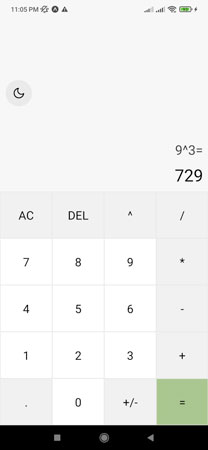

# Calculadora React Native

## Sobre o projeto

Código de uma Calculadora com temas light e dark, foi criada usando a ferramenta Expo em React Native

## Telas

- Tema light:



- Tema dark:


## Como usar

<br>

- clone o repositório com o seguinte comando:

```git
git clone https://github.com/Lucasm4sco/Calculadora-React-Native.git
```

- Navegue até a pasta do projeto via terminal e execute:

```node
npm install
```

- O comando acima irá instalar as dependências necessárias do código, assim que as dependências forem instaladas você pode iniciar o projeto com os comandos ```npm start``` ou ```npx expo start``` no terminal;

- Após isso será gerado um QRcode que você poderá usar pra acessar o aplicativo através de um emulador ou pelo aplicativo Expo go disponível na Play Store.
